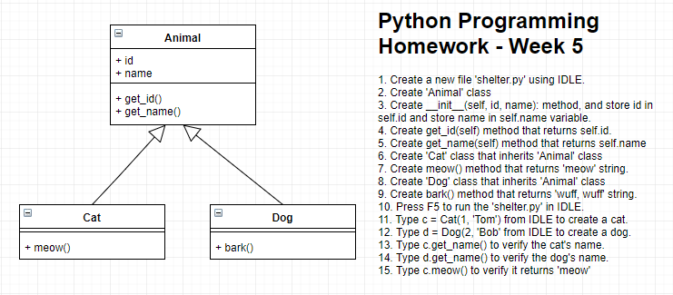

# Python Programming - Lecture 6

* * *

* [Presentation for Week 5](https://docs.google.com/presentation/d/1FUcFb78FCY9WI3JxZdZJAR-JmhqIJ4gZu3GnRlptivg/edit?usp=sharing)


### Review of Homework



- name of class should start with upper case
- variables and methods should be all lower case
- Here is an example of the [source code](./shelter.py) for the homework


* * *

### Let's Practice Typing
- Go to [Nitro Type](https://www.nitrotype.com)
- Practice typing for 5 minutes
- Let's measure your typing speed

### Chapter 9 - Python’s Built-in Functions
Launch IDLE

##### input()
```
>>> year = input('Year of birth: ')
Year of birth: 2000
>>> 'You were born in {}'.format(year)
'You were born in 2000'
>>>
```

##### len(), min(), max(), sum()
```
>>> A = [5, 4, 10, 20, 30]
>>> len(A)
5
>>> min(A)
4
>>> max(A)
30
>>> sum(A)
69
```

##### type conversion
```
>>> a = '5.5'
>>> int(a)
Traceback (most recent call last):
  File "<pyshell#42>", line 1, in <module>
    int(a)
ValueError: invalid literal for int() with base 10: '5.5'
>>> float(a)
5.5
>>> bool(a)
True
>>> a = 0
>>> bool(a)
False
>>> a = 10
>>> a = '10'
>>> a + 20
Traceback (most recent call last):
  File "<pyshell#49>", line 1, in <module>
    a + 20
TypeError: must be str, not int
>>> int(a) + 20
30
```

##### abs()
```
abs(-10)
>>> if abs(steps) > 0:
	print('character is moving')
-> Recover (by typing on a line)
```

##### dir(), help()
```
>>> dir('hello')
>>> help('hello'.upper)
>>> 'hello'.upper()
'HELLO'
```

##### eval()
```
eval()
>>> formula = input('Enter formula: ')
Enter formula: 12*52
>>> eval(formula)
624
```

##### File open / write

```
>>> file = open('C:\Users\jason\Documents\hello.txt')
SyntaxError: (unicode error) 'unicodeescape' codec can't decode bytes in position 2-3: truncated \UXXXXXXXX escape
>>> file = open('C:\\Users\\jason\\Documents\\hello.txt')
>>> print(file.read())
fdsfasfsfasfas
>>>
KeyboardInterrupt
>>> file = open('C:\\hello.txt')

>>> file = open('C:\\Users\\jason\\Documents\\hello2.txt', 'w')
>>> file.write('This is a test.')
15
>>> file.close()
```

##### Quiz
```
>>>bool(4)
>>>a, b = 10, ‘20’
>>>a+b
```

* * *

### Chapter 10 - Useful Python Modules

##### turtle
```
>>> import turtle
```

##### random
```
>>> import random
>>> A = [10, 20, 30, 40, 50]
>>> random.choice(A)
50
>>> random.choice(A)
30
>>> random.choice(A)
50
>>> random.choice(A)
30
>>> random.choice(A)
40
```

##### time
```
>>> import time
>>> time.time()
1511711769.7801137
>>> time.time()
1511711773.4365573
>>> time.asctime()
'Sun Nov 26 07:56:51 2017'
>>> time.localtime()
time.struct_time(tm_year=2017, tm_mon=11, tm_mday=26, tm_hour=7, tm_min=57, tm_sec=12, tm_wday=6, tm_yday=330, tm_isdst=0)
>>> time.localtime()[0]
2017
>>>
```

##### pickle
```
>>> A = [10, 20, 30, 40, 50]
>>> import pickle
>>> pickle.dump(A, open('my_data.p', 'wb'))

# Close IDLE and re-launch IDLE
>>> A = pickle.load(open('my_data.p','rb'))
>>> A
[10, 20, 30, 40, 50]
```

* * *

### Lubuntu virtual machine
Make sure everybody got the Lubuntu copy and have a working version

### Code Combat
- https://codecombat.com
